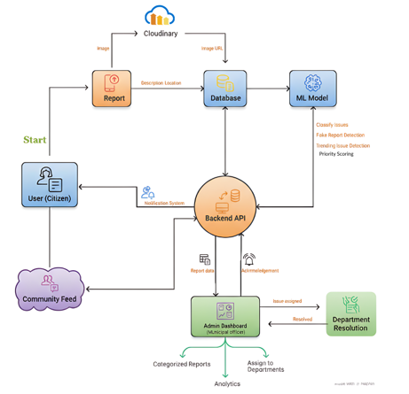

# CivicIssue

CivicIssue is a Django-based civic complaints platform that lets citizens report local issues (with photos and location), routes them through a backend API and ML-powered moderation pipeline, and helps municipal administrators triage, assign, and resolve them. Reports are surfaced back to the community through a public feed and a notification system.

## Features

- **Citizen reporting** — Submit complaints with description, location, and an image.
- **Cloud media storage** — Images are uploaded to Cloudinary; only the URL is persisted in the database.
- **ML-assisted triage** — Classifies issues, detects fake reports, identifies trending issues, and assigns a priority score.
- **Community feed** — Public-facing feed of reported issues with likes, comments, and shares.
- **Admin dashboard** — Municipal office view to categorize reports, assign them to departments, and view analytics.
- **Department resolution** — Issues are routed to the correct department, marked resolved, and acknowledged back to the citizen.
- **Notification system** — Citizens are notified when status changes occur.

## Architecture

The high-level flow of data and responsibilities across the system:



### Flow walkthrough

1. **User (Citizen)** opens the app and starts a new **Report**.
2. The image attached to the report is uploaded to **Cloudinary**, which returns a hosted **image URL**.
3. The **Report** (description, location, and image URL) is stored in the **Database** via the **Backend API**.
4. The **ML Model** reads from the database to:
   - Classify issues into categories
   - Detect fake reports
   - Detect trending issues
   - Compute a priority score
5. The **Backend API** is the central hub — it serves the **User**, the **Community Feed**, and the **Admin Dashboard**.
6. The **Admin Dashboard (Municipal office)** receives **report data**, presents **categorized reports** and **analytics**, and lets admins **assign to departments**.
7. **Department Resolution** handles assigned issues and reports back when **resolved**.
8. The **Backend API** sends an **acknowledgement** through the **Notification System** to the citizen, and the resolved/updated report appears in the **Community Feed**.

## Tech stack

- **Backend:** Python 3.12, Django 5.2
- **Database:** PostgreSQL (SQLite fallback for local dev)
- **Static files:** WhiteNoise
- **Media storage:** Cloudinary (optional; falls back to local filesystem)
- **Server:** Gunicorn (production), Django dev server (development)

## Project layout

```
civicissue/        # Django project (settings, urls, wsgi)
complaints/        # Main app: models, views, forms, templates, auth
manage.py          # Django entry point
requirements.txt   # Python dependencies
docs/              # Documentation assets (architecture diagram, etc.)
```

## Running locally

1. Install dependencies:
   ```bash
   pip install -r requirements.txt
   ```
2. Apply database migrations:
   ```bash
   python3 manage.py migrate
   ```
3. Start the development server:
   ```bash
   python3 manage.py runserver 0.0.0.0:5000
   ```
4. Open the app at `http://localhost:5000/`.

## Environment variables

| Variable | Purpose |
| --- | --- |
| `SECRET_KEY` | Django secret key |
| `DEBUG` | `True` / `False` |
| `DATABASE_URL` | PostgreSQL connection string (optional; SQLite is used if unset) |
| `CLOUDINARY_CLOUD_NAME` | Cloudinary cloud name (optional) |
| `CLOUDINARY_API_KEY` | Cloudinary API key (optional) |
| `CLOUDINARY_API_SECRET` | Cloudinary API secret (optional) |

## Deployment

The app is configured for autoscale deployment. The production command runs migrations, collects static files, and serves the app with Gunicorn:

```bash
python3 manage.py migrate --noinput && \
python3 manage.py collectstatic --noinput && \
gunicorn --bind=0.0.0.0:5000 --reuse-port civicissue.wsgi:application
```
